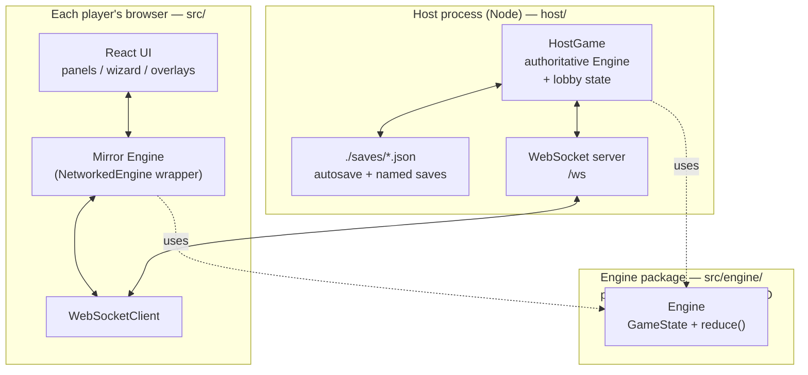
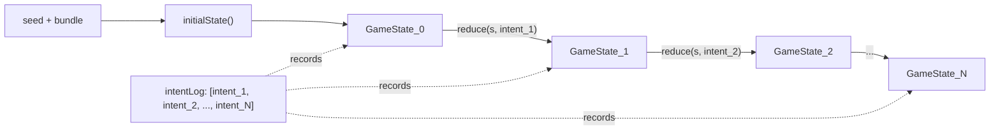
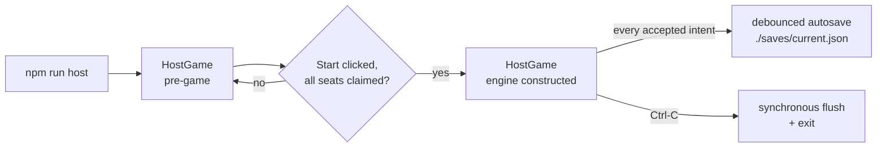
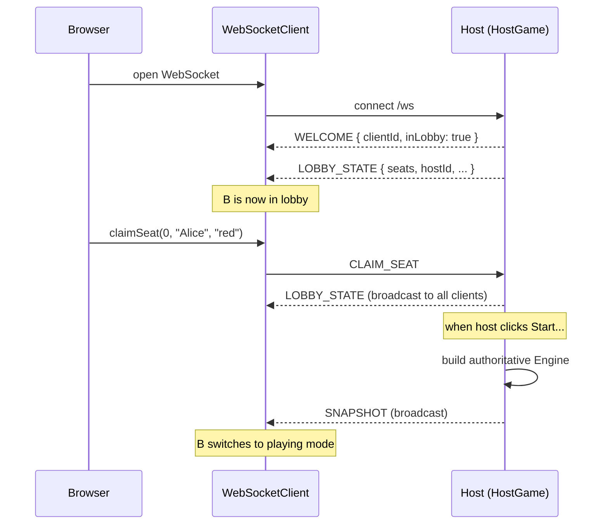
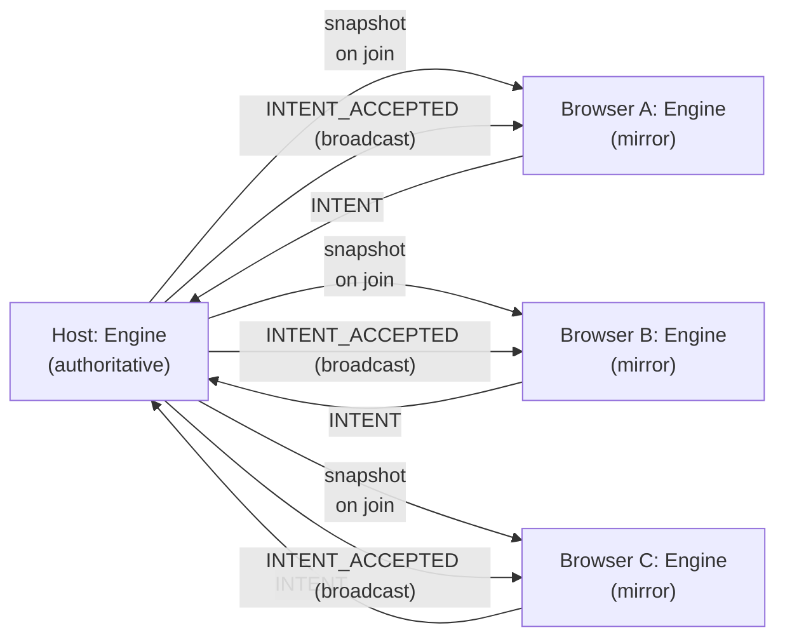
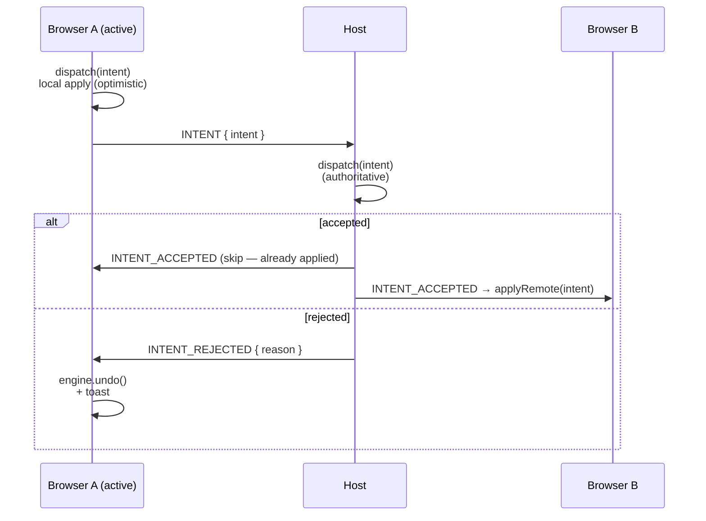
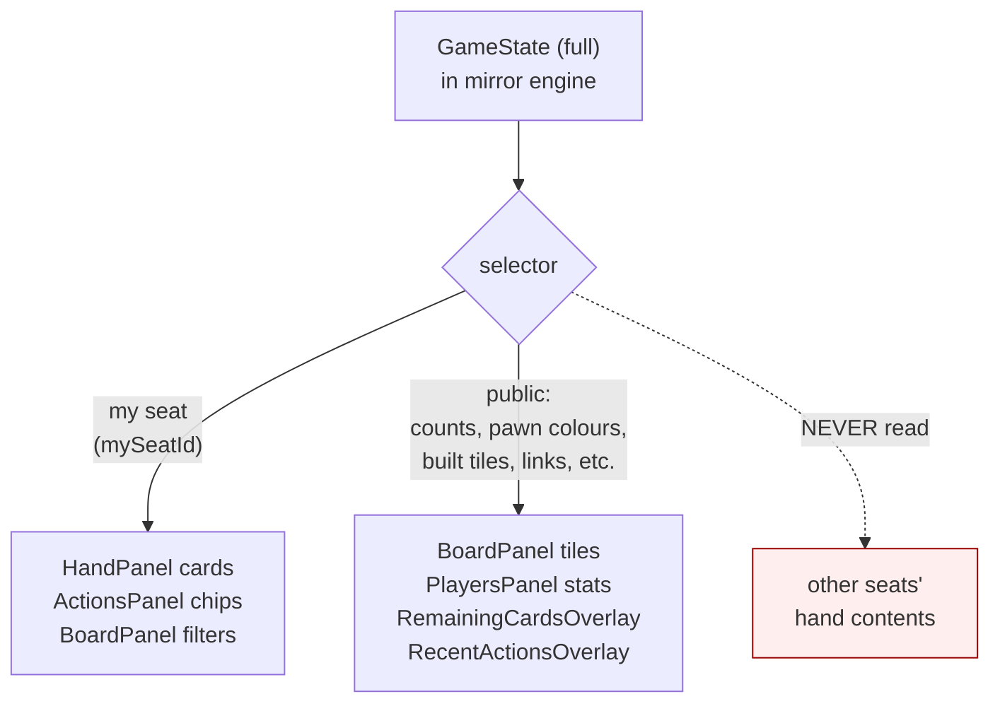
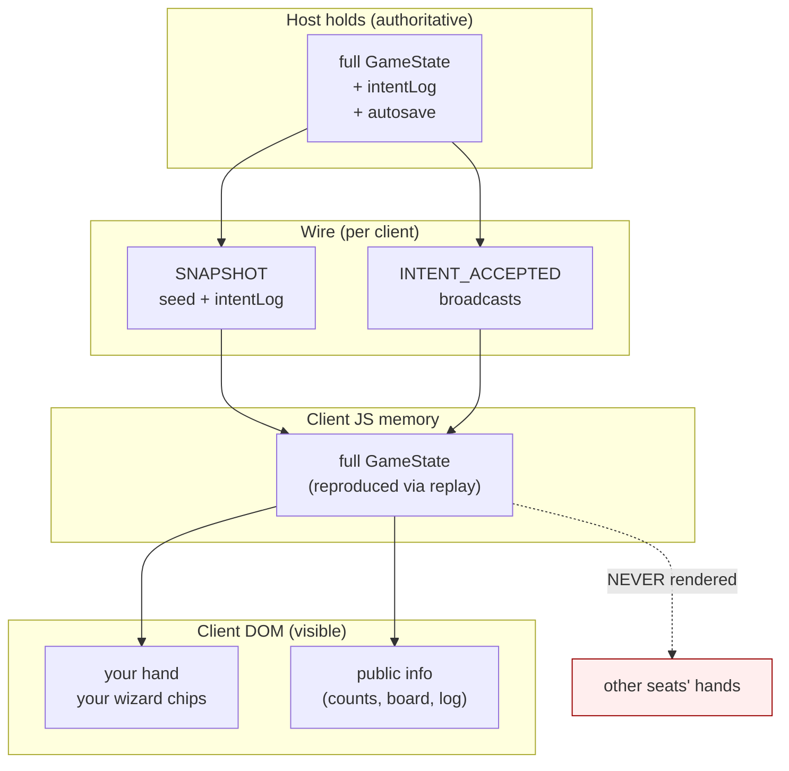

# Architecture

How the pieces fit together: the **engine**, the **UI**, the **host
process**, and the **network protocol** between them. This is a
companion to `docs/network-howto.md` (operator-focused) and
`docs/game-spec.md` (rules-focused).

---

## 1. The four layers



Three deployable layers, plus one shared library:

| Layer | Lives in | Job |
|---|---|---|
| **Engine** (library) | `src/engine/` | Pure rules. Given a `(seed, config, intentLog)` it deterministically produces `GameState`. No React, no DOM, no network. The same code runs on the host and inside every browser. |
| **Host process** | `host/` (Node + `tsx`) | Runs the *authoritative* engine, owns the lobby state, autosaves to disk, accepts WebSocket connections from clients and brokers their intents. |
| **UI** | `src/ui/` (React) | Reads from a *mirror* engine inside the browser; collects clicks via the wizard state machine and dispatches intents. Knows nothing about the network beyond "engine.dispatch". |
| **Network glue** | `src/network/` | The wire protocol (`protocol.ts`), the per-client transport (`WebSocketClient.ts`), and the wrapper that monkey-patches a mirror engine so its successful dispatches forward to the host (`NetworkedEngine.ts`). |

The engine library is the one piece *both sides import* — that's how
they stay deterministic. Anything outside `src/engine/` (UI, host,
network) can use the engine, but the engine never imports up.

---

## 2. What the engine does

The engine is a single class plus a pile of pure functions. It owns:

- `GameState` — the full game position: `players`, `era`, `round`,
  `currentPlayerIndex`, `drawDeck`, `builtTiles`, `merchantSlots`, etc.
- An `intentLog: Intent[]` — every successful dispatch, append-only.
- A `seed` and a `bundle` (cards/cities/tiles/links config) — together
  with the intent log they fully determine `GameState`.



Three properties are load-bearing:

1. **Determinism.** `(seed, bundle, intentLog)` → exactly one
   `GameState`. No `Math.random()` anywhere — RNG comes from the
   seeded `pure-rand` instance.
2. **Append-only log.** The reducer never mutates past entries. Undo
   is implemented as "pop the last intent, replay everything else from
   `initialState`" — this is also how saves load.
3. **No I/O.** The engine has no idea whether it's running on a Node
   server or in someone's browser. That's why the same code runs both
   places.

The reducer dispatches on `intent.type` (BUILD / NETWORK / DEVELOP /
SELL / LOAN / SCOUT / PASS / END_TURN / RESOLVE_SHORTFALL) — see
`src/engine/reduce.ts:22`. Each action lives in its own file under
`src/engine/actions/`.

---

## 3. What the UI does

The UI is React. It does **not** own state; it subscribes to the
mirror engine and re-renders. Three things happen in the UI:

### 3.1 Render game state
Each panel reads slices of `GameState` via `useGameState(selector)`
(thin wrapper around `useSyncExternalStore`). When the engine notifies
subscribers after a successful dispatch, components whose selected
slice changed re-render.

### 3.2 Drive the wizard
Card / slot / industry / line clicks feed the **wizard reducer**
(`src/ui/wizards/WizardProvider.tsx`). The wizard accumulates the
`(card, industry, slot, ...)` picks for an action, validates them
locally for fast feedback, and assembles a final `Intent` object once
all required pieces are in place. The wizard is local React state —
it never leaves the browser.

### 3.3 Dispatch intents
When the wizard has a complete `Intent`, it calls
`engine.dispatch(intent)`. The engine validates and either applies
the change (notifies subscribers) or returns `{ ok: false, reason }`.
On a *networked* mirror engine, a successful dispatch is also
forwarded to the host (see §6).

```mermaid
flowchart LR
  click["user click"] --> wizard["WizardProvider
  (local React state)"]
  wizard -- "complete Intent" --> dispatch["engine.dispatch(intent)"]
  dispatch -- ok --> notify["engine notifies subscribers"]
  notify --> rerender["panels re-render"]
  dispatch -- "ok (networked)" -.->|forward to host| net["WebSocketClient"]
  dispatch -- rejected --> toast["sonner toast"]
```

Notable UI pieces:

- `App.tsx` — top-level switch: lobby vs. playing.
- `BoardPanel` — the SVG board (cities, slots, links, market).
- `PlayersPanel` — one mat per seat (viewer's mat first, see §7).
- `HandPanel` — the viewer's own hand. Cards go inert on others' turns.
- `ActionsPanel` — verb buttons + wizard chip strip.
- `ViewerBanner` — top-of-screen pawn-coloured "you are" pill +
  whose-turn status.

---

## 4. The host process

`npm run host` boots `host/server.ts`, which:

1. Parses CLI flags (with the `--` / `npm_config_*` tolerance fix).
2. Constructs **one** `HostGame` (the authoritative game session).
3. Starts an HTTP server (serves `./dist` if built; otherwise tells you
   to use Vite's dev server) and a WebSocket server on `/ws`.
4. Listens for WebSocket connections and routes each message through
   the `HostGame`'s handlers.

`HostGame` (in `host/HostGame.ts`) owns:

- The current `LobbyState` (pre-game) — seat list, locked flag,
  "loaded from save?" flag, host id.
- A possibly-null `Engine` (the authoritative game state). Null until
  the host clicks **Start**, then constructed and populated by replaying
  any loaded-save intent log.
- The connected clients (`Map<clientId, send>`).
- The autosave file path and a debounce timer.



Saves on disk are full `SaveFile` records: `seed`, `playerCount`,
`autoEndTurn`, `allowUndo`, the resolved config `bundle` (including
seat identities — names + pawn colours), the `intentLog`, and a
`createdAt` timestamp. Loading a save is just rebuilding a fresh
engine from the same seed + bundle and replaying the log.

---

## 5. Clients and the lobby

> "Is each person who joins a client?" — Yes. Every browser tab is
> one client.

When a browser opens the host's URL:

1. The HTML/JS bundle is served (or Vite proxies to it during dev).
2. `useNetworkClient` opens a WebSocket to `/ws`.
3. The host sends a `WELCOME` with a fresh `clientId` (UUID).
4. The host sends the current `LOBBY_STATE` (or a `SNAPSHOT` if the
   game is already in progress — see §6.3).

The first client to connect becomes the **lobby host** (their
`clientId` is recorded in `LobbyState.hostId`). Only the lobby host
sees the **Players 2/3/4** / **Load save** / **Lock lobby** /
**Start game** controls in `LobbyScreen.tsx`. If the host disconnects
before starting, the host id transfers to whoever's still connected.



Players claim a seat (name + colour). Once every seat has a
`claimedBy`, the host clicks **Start** and the host process builds
its authoritative engine.

---

## 6. The networked engine

### 6.1 Two engines, one source of truth

There are conceptually two engines on every networked turn:

- The **authoritative engine** on the host. Its state is what
  matters for autosave and for every newcomer's snapshot.
- A **mirror engine** in each connected browser. It exists so the UI
  can render `GameState` without a round-trip on every read.

The mirror is created from the host's snapshot — which includes the
seed, bundle, and intent log — and replays the log to reach the
current state. After that, both engines stay in sync because they
process the **same intents in the same order**.



### 6.2 Optimistic dispatch

When the *active* player clicks an action:

1. Their wizard assembles an `Intent`.
2. They call `engine.dispatch(intent)` — the patched dispatch in
   `NetworkedEngine.ts` runs the local reducer **first** (instant UI
   feedback), then forwards `INTENT { intent }` to the host.
3. The host validates (seat ownership, engine rules), and either:
   - Broadcasts `INTENT_ACCEPTED { intent, originator }` to all
     clients. Other clients apply via `applyRemote(intent)` (which
     uses the *unwrapped* dispatch so it doesn't re-forward). The
     originator already applied locally — they skip on receipt.
   - Sends `INTENT_REJECTED { reason, intent }` to just the sender,
     who calls `engine.undo()` to roll back the optimistic apply
     and shows a toast.



This is the standard board-game pattern: deterministic engine + an
authoritative server that orders intents.

### 6.3 Joining mid-game

A client that connects after the game started gets a `SNAPSHOT`
instead of `LOBBY_STATE`. The snapshot carries
`{ seed, playerCount, autoEndTurn, allowUndo, bundle, intentLog,
paused }`. The browser builds a fresh `Engine` from that and then
patches its dispatch via `networkifyEngine`. From then on, every
`INTENT_ACCEPTED` broadcast keeps it in sync.

---

## 7. The privacy boundary

> "The host has all the information about all players but the client
> should not have all the information so how is this handled?"

This is the most important question, and the honest answer is in two
parts: **what the client sees in its UI** and **what the client
holds in JS memory**.

### 7.1 The UI privacy boundary (enforced)

The UI never *renders* another seat's hand contents. Concretely:

| Surface | What it shows | Notes |
|---|---|---|
| `HandPanel` | **Only your seat's hand**. | Selected by `mySeatId`, not the active player's id. Cards go inert on other players' turns. |
| `ActionsPanel` chips/issues | Driven by `myHand` + `myPlayer`. | Wizard verbs are disabled unless `isMyTurn`, so the chip strip can only ever contain your own picks anyway. |
| `BoardPanel` build filter | Driven by `myHand`. | Same defence-in-depth choice. |
| `PlayersPanel` per-seat row | Public info only: name, colour, money, VP, income level, **hand size** (count, not contents), link supply. | Hand size is public in the physical game too. |
| `RemainingCardsOverlay` | Aggregate counts of unplayed cards across the deck + every hand. | Total counts only — never "Bob holds 2 Birminghams". Same as counting discards in the physical game. |
| `RecentActionsOverlay` | Past dispatched intents (which card was played, where, etc). | Played cards are public information — they entered the discard pile. |
| `ViewerBanner` | Your name, current active player's name + colour. | Public. |

Action gating closes the loop on the *interactive* side: `canAct`,
`canEndTurn`, and the Undo button are all gated on
`isMyTurn = activePlayerId === mySeatId`. So clicks from a non-active
viewer can't even reach the wizard, let alone produce a chip that
references someone else's card.



### 7.2 The mirror's in-memory state (architectural caveat)

The honest part: **the mirror engine in your browser holds the full
GameState in JS memory**, including everyone's hands. That's because
it was built deterministically from `(seed, bundle, intentLog)` and
the engine's `initialState` deals every player's starting hand in
known positions. The engine doesn't *know* about privacy; it just
keeps the rules consistent.

What's NOT shielded today:

- A player who opens DevTools could read the full state object.
- The seed + intent log lets anyone reconstruct everything offline.

What IS shielded:

- The DOM never shows another seat's hand.
- The wizard, dispatch path, and selectors only ever read your own
  seat's private data.
- The host filters intents by seat ownership, so a malicious client
  can't act on another seat even if it tries.

This is the same trade-off that most digital board-game implementations
make — full sync is what makes the UI snappy and reconnects trivial.
Closing this gap fully would mean the host shipping a *redacted
per-seat snapshot* (different seed-equivalent for each viewer, with
unseen cards opaque) and broadcasting only enough information about
each accepted intent for everyone to advance their view of public
state. That's a substantial rework, not a small patch.

The privacy posture, summarised:



---

## 8. Lifecycle, end-to-end

Putting it all together for one round-trip:

```mermaid
sequenceDiagram
    participant Alice as Alice's browser
    participant Host as Host process
    participant Bob as Bob's browser
    participant Disk as ./saves/current.json

    Note over Host: lobby phase
    Alice->>Host: connect → WELCOME, LOBBY_STATE
    Bob->>Host: connect → WELCOME, LOBBY_STATE
    Alice->>Host: SET_PLAYER_COUNT 3
    Host-->>Alice: LOBBY_STATE (3 seats)
    Host-->>Bob: LOBBY_STATE (3 seats)
    Alice->>Host: CLAIM_SEAT(0, "Alice", red)
    Bob->>Host: CLAIM_SEAT(1, "Bob", blue)
    Note over Alice,Bob: third seat claimed elsewhere
    Alice->>Host: START_GAME
    Host->>Host: build authoritative Engine
    Host-->>Alice: SNAPSHOT
    Host-->>Bob: SNAPSHOT
    Note over Alice,Bob: both build mirror engines

    Note over Alice,Bob: it's Alice's turn
    Alice->>Alice: wizard collects Build intent
    Alice->>Alice: engine.dispatch (optimistic apply)
    Alice->>Host: INTENT
    Host->>Host: validate + dispatch (authoritative)
    Host->>Disk: schedule autosave (debounced 1s)
    Host-->>Alice: INTENT_ACCEPTED (skipped — already applied)
    Host-->>Bob: INTENT_ACCEPTED → applyRemote
    Note over Bob: mirror advances; UI rerenders

    Note over Alice,Bob: Alice ends turn
    Alice->>Host: INTENT { END_TURN }
    Host-->>Alice: INTENT_ACCEPTED
    Host-->>Bob: INTENT_ACCEPTED
    Note over Bob: Bob's UI flips: "Your turn"
```

---

## 9. Where to look in the code

| If you want to understand… | Read |
|---|---|
| Game rules (the truth) | `docs/game-spec.md`, then `src/engine/actions/*.ts` |
| The state object | `src/engine/types.ts` (`GameState`) |
| How a fresh game is built | `src/engine/initialState.ts` |
| How an action becomes state | `src/engine/reduce.ts` → per-action file |
| How undo works | `src/engine/Engine.ts` (`undo`) |
| The wire protocol | `src/network/protocol.ts` |
| How clients stay in sync | `src/network/NetworkedEngine.ts` + `src/ui/hooks/useNetworkClient.ts` |
| The host's responsibilities | `host/HostGame.ts` + `host/server.ts` |
| Lobby rules | `host/lobby.ts` |
| Save file format & loading | `src/network/saveFile.ts` + `host/saves.ts` |
| The wizard state machine | `src/ui/wizards/WizardProvider.tsx` |
| Privacy enforcement | `src/ui/panels/HandPanel.tsx`, `ActionsPanel.tsx`, `BoardPanel.tsx`, `src/ui/hooks/EngineProvider.tsx` |

---

## 10. Summary in one paragraph

Brass Birmingham digital is built around a **pure-functional engine**
shared between the Node host and every browser. The host runs the
authoritative engine, persists `./saves/current.json`, and orchestrates
the lobby. Each browser is an independent client with its own mirror
engine; clients dispatch intents optimistically and rely on the host
to broadcast acceptance so all mirrors advance in lock-step. The UI
enforces a privacy boundary by selecting only the viewer's own
private data through `mySeatId` while letting public data flow
freely; the in-memory mirror still holds full state, but never
renders another seat's secrets.
