# Network layer — detailed reference

Companion to `docs/architecture.md` (high-level four-layer diagram) and
`docs/network-howto.md` (operator-focused: how to start a host, how to
join). This document zooms into the **network layer** specifically — the
code that turns the in-process engine into a multiplayer-over-WebSocket
game — and explains why each component exists.

The network layer lives in two places:

- **`host/`** — the Node process that owns the authoritative engine,
  handles lobby + reconnect, persists saves, and projects per-recipient
  views. Runs on whoever's hosting the game.
- **`src/network/`** — the wire protocol (shared) plus the browser-side
  WebSocket transport and the engine compatibility shim that every
  client uses to render. Bundled into the React app.

Everything below is grounded in the actual files; line references are
suggestive, not load-bearing.

---

## 1. Topology — who runs what, and where the trust line is

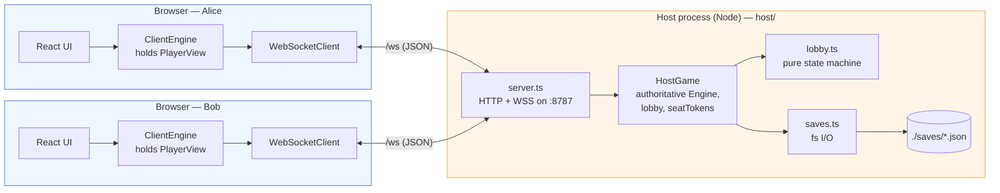
```mermaid
flowchart LR
  subgraph host_node["Host process (Node) — host/"]
    SRV["server.ts<br/>HTTP + WSS on :8787"]
    HG["HostGame<br/>authoritative Engine,<br/>lobby, seatTokens"]
    LOB["lobby.ts<br/>pure state machine"]
    SV["saves.ts<br/>fs I/O"]
    DSK[("./saves/*.json")]
    SRV --> HG
    HG --> LOB
    HG --> SV
    SV --> DSK
  end

  subgraph cli_a["Browser — Alice"]
    WSA["WebSocketClient"]
    CEA["ClientEngine<br/>holds PlayerView"]
    UIA["React UI"]
    UIA --> CEA --> WSA
  end

  subgraph cli_b["Browser — Bob"]
    WSB["WebSocketClient"]
    CEB["ClientEngine<br/>holds PlayerView"]
    UIB["React UI"]
    UIB --> CEB --> WSB
  end

  WSA <-- "/ws (JSON)" --> SRV
  WSB <-- "/ws (JSON)" --> SRV

  style host_node fill:#fff5e6,stroke:#e0a040
  style cli_a fill:#eef6ff,stroke:#406bcc
  style cli_b fill:#eef6ff,stroke:#406bcc
```

The **trust line** runs along the WebSocket. Everything inside the host
process is trusted; everything in a browser is not. The protocol is
designed so a malicious client patching its own JS gains nothing — the
host filters every outbound message and verifies every inbound one.

---

## 2. The two halves at a glance

| File | Layer | One-line job |
|---|---|---|
| `host/server.ts` | host | Process entry. HTTP + WebSocket server, CLI parsing, static `dist/` serving, signal handling. |
| `host/HostGame.ts` | host | Authoritative session: lobby + Engine + connections + seatTokens + autosave. |
| `host/lobby.ts` | host | Pure lobby state machine (claim / release / lock). |
| `host/saves.ts` | host | Save-file fs I/O + path-safety + listing. |
| `host/tsconfig.json` | host | Node-targeting TS config. |
| `src/network/protocol.ts` | shared | Wire message types, version, encode/parse helpers. |
| `src/network/saveFile.ts` | shared | Save-file schema + (de)serialization. |
| `src/network/WebSocketClient.ts` | browser | Single durable WebSocket with reconnect/backoff/buffer. |
| `src/network/ClientEngine.ts` | browser | Compat shim — same surface as `Engine`, holds a `PlayerView`. |
| `src/network/eventLog.ts` | browser | Derives the public recent-actions log from STATE diffs. |
| `src/network/Transport.ts` + `LoopbackTransport.ts` + `NetworkAdapter.ts` | shared | **Vestigial.** Original intent-bus scaffold from before the host existed. Not imported anywhere. |

---

## 3. The protocol — what's on the wire

`PROTOCOL_VERSION = 2`. All messages are JSON-encoded
discriminated-union members.

### 3.1 Server → Client

| Verb | Payload |
|---|---|
| `WELCOME` | `clientId`, `inLobby`, `protocolVersion` |
| `LOBBY_STATE` | `seats`, `locked`, `hostId`, `playerCount`, `fromSave` |
| `SNAPSHOT` | `PlayingEnvelope` + `seats` + `seatToken` |
| `STATE` | `PlayingEnvelope` + `cause` |
| `INTENT_REJECTED` | `reason`, echo of `intent` |
| `RESUMED` | `seatId` |
| `PAUSED` | `paused` |
| `SAVES_LIST` | `SaveSummary[]` |
| `ERROR` | `message` |

**`PlayingEnvelope`** wraps every game-state message:

```ts
{ view: PlayerView, paused, allowUndo, canUndoNow }
```

- `view` is the **per-recipient redacted projection** (more in §6).
- `paused` / `allowUndo` are session-level toggles.
- `canUndoNow` folds the host's authoritative answer to "may *you*
  press Undo right now?" so the button's enabled state doesn't
  require the client to re-derive turn boundaries.

**`STATE`** also carries a `cause`:

```ts
| { kind: "intent"; intent; originator }
| { kind: "undo" }
| { kind: "snapshot" }
```

The cause drives the client's local recent-actions log (append / pop /
reset — see §7).

### 3.2 Client → Server

Grouped by phase:

- **Lobby (any client):** `CLAIM_SEAT`, `RELEASE_SEAT`, `RESUME`
- **Lobby (host only):** `LOCK_LOBBY`, `START_GAME`, `SET_PLAYER_COUNT`,
  `LOAD_SAVE`, `NEW_GAME`, `LIST_SAVES`
- **In-game (active seat):** `INTENT`, `UNDO`
- **In-game (host only):** `SET_PAUSED`

Lobby-only verbs (`CLAIM_SEAT`, `LOCK_LOBBY`, `LOAD_SAVE`, etc.) are
rejected during play; gameplay verbs (`INTENT`, `UNDO`) are rejected
before the game starts. Host-only verbs (`SET_PLAYER_COUNT`,
`LOCK_LOBBY`, `LOAD_SAVE`, `NEW_GAME`, `SET_PAUSED`) check the caller's
clientId against `lobby.hostId` and emit `ERROR` if it doesn't match.

### 3.3 Why a typed protocol module exists

Three reasons:

1. **TypeScript checks both ends from one source.** The host imports the
   same union `parseClientMessage` returns; the browser imports the same
   union `WebSocketClient` dispatches. Adding a new verb is one type
   addition + two switch arms. The compiler finds the rest.
2. **Versioning is explicit.** `PROTOCOL_VERSION` ships in `WELCOME`.
   The phase-3b refactor bumped it to 2, and old clients can be
   detected and refused on connect (currently the bump is documentary;
   enforcement is a future hardening task).
3. **The wire is the boundary.** Reads through `parseServerMessage` /
   `parseClientMessage` are gated on a `type` field and a switch — so
   garbage doesn't reach the engine. (Future improvement: zod-style
   field validation; today it's structural via TS.)

---

## 4. The host process

### 4.1 `server.ts` — process entry

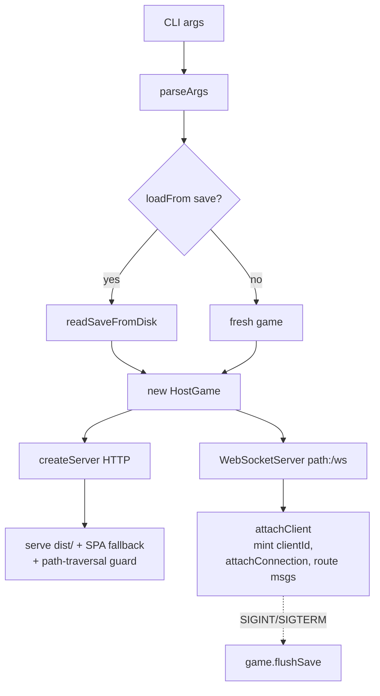
```mermaid
flowchart TB
  CLI[CLI args] --> PA[parseArgs]
  PA --> CFG{loadFrom save?}
  CFG -- yes --> RD[readSaveFromDisk]
  CFG -- no --> NEW[fresh game]
  RD --> HG[new HostGame]
  NEW --> HG
  HG --> HTTP[createServer HTTP]
  HG --> WSS["WebSocketServer path:/ws"]
  HTTP --> STATIC["serve dist/ + SPA fallback<br/>+ path-traversal guard"]
  WSS --> ATTACH["attachClient<br/>mint clientId,<br/>attachConnection, route msgs"]
  ATTACH -. SIGINT/SIGTERM .-> FLUSH[game.flushSave]
```

Responsibilities:

- **CLI parsing with rescue paths.** `npm run host -- --player-count 3`
  is the canonical form, but `npm run host --player-count 3` (no `--`)
  is the most common mistake — npm eats the flag. The parser handles
  the env-var fallback (`npm_config_*`) and the bare-positional
  rescue, with a warning. This is a UX cushion, not a security
  boundary.
- **HTTP + WebSocket on one port.** The `dist/` build is served from
  the HTTP side; `/ws` is the WebSocket. Same origin → no CORS dance.
- **Static safety.** `serveStatic` resolves the URL inside `DIST_DIR`
  and 403s anything that escapes — defends against `../../etc/passwd`.
- **Signal-safe shutdown.** SIGINT/SIGTERM trigger `flushSave()`
  *before* exit so the autosave on disk is never older than the last
  intent.

### 4.2 `HostGame.ts` — the authoritative session

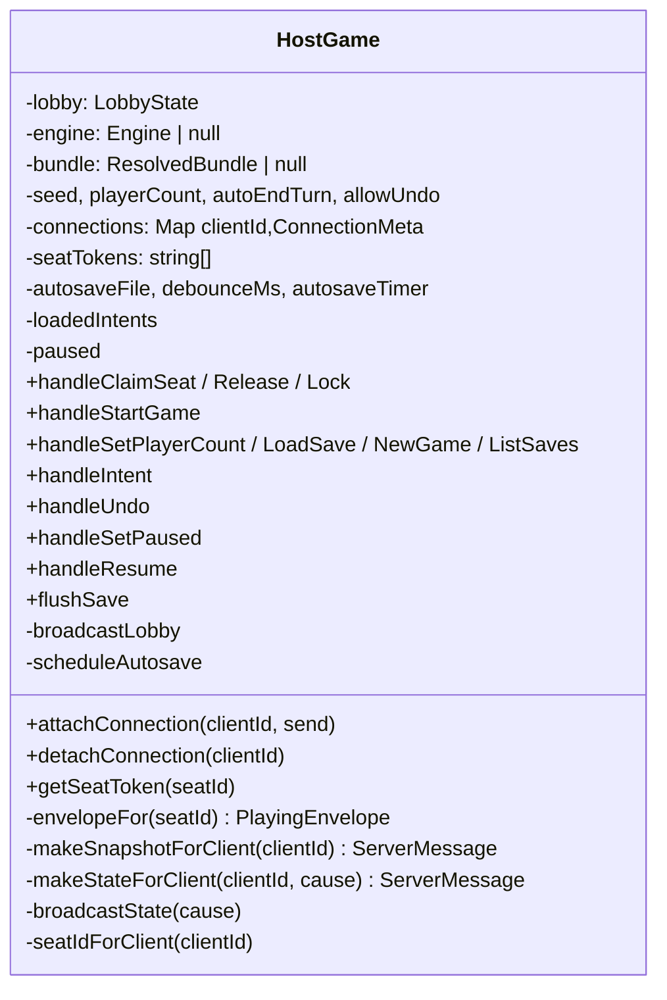
```mermaid
classDiagram
  class HostGame {
    -lobby: LobbyState
    -engine: Engine | null
    -bundle: ResolvedBundle | null
    -seed, playerCount, autoEndTurn, allowUndo
    -connections: Map clientId,ConnectionMeta
    -seatTokens: string[]
    -autosaveFile, debounceMs, autosaveTimer
    -loadedIntents
    -paused
    +attachConnection(clientId, send)
    +detachConnection(clientId)
    +handleClaimSeat / Release / Lock
    +handleStartGame
    +handleSetPlayerCount / LoadSave / NewGame / ListSaves
    +handleIntent
    +handleUndo
    +handleSetPaused
    +handleResume
    +flushSave
    +getSeatToken(seatId)
    -envelopeFor(seatId) PlayingEnvelope
    -makeSnapshotForClient(clientId) ServerMessage
    -makeStateForClient(clientId, cause) ServerMessage
    -broadcastState(cause)
    -broadcastLobby
    -scheduleAutosave
    -seatIdForClient(clientId)
  }
```

**State owned by `HostGame`:**

- The `LobbyState` (pre-game) and the `Engine` instance (post-start).
  `engine` is `null` until `handleStartGame` succeeds.
- `connections` — a `Map<clientId, { send }>` for the live sockets.
  Per-client `send` is what `attachConnection` injected; the host
  doesn't know it's a WebSocket, only that it can deliver typed
  messages.
- `seatTokens[]` — one random UUID per seat, minted at game start (or
  loaded from a save), persisted in saves on every flush. The bearer
  capability that makes reconnect work.
- The autosave debounce timer + path. `scheduleAutosave` is called
  after every accepted intent; the actual disk write is debounced so
  rapid-fire intents don't pin the I/O thread.

**Methods are 1:1 with the protocol verbs.** `routeMessage` in
`server.ts` is a switch with one case per verb that calls the matching
`handle*`. Anything off the happy path emits a targeted `ERROR`.

#### 4.2.1 Why per-recipient projection lives here

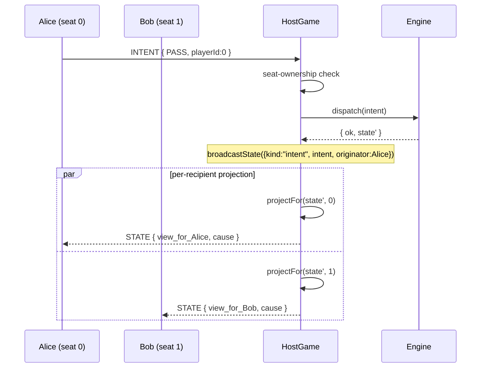
```mermaid
sequenceDiagram
  participant Cli_A as Alice (seat 0)
  participant Cli_B as Bob (seat 1)
  participant Host as HostGame
  participant Eng as Engine
  Cli_A->>Host: INTENT { PASS, playerId:0 }
  Host->>Host: seat-ownership check
  Host->>Eng: dispatch(intent)
  Eng-->>Host: { ok, state' }
  Note over Host: broadcastState({kind:"intent", intent, originator:Alice})
  par per-recipient projection
    Host->>Host: projectFor(state', 0)
    Host-->>Cli_A: STATE { view_for_Alice, cause }
  and
    Host->>Host: projectFor(state', 1)
    Host-->>Cli_B: STATE { view_for_Bob, cause }
  end
```

Each recipient gets its own `PlayerView` — Alice sees her hand, Bob
sees his, neither sees the other's. This loop is the **only** place in
the system that touches another player's hidden info on the way out.

### 4.3 `lobby.ts` — pure state machine

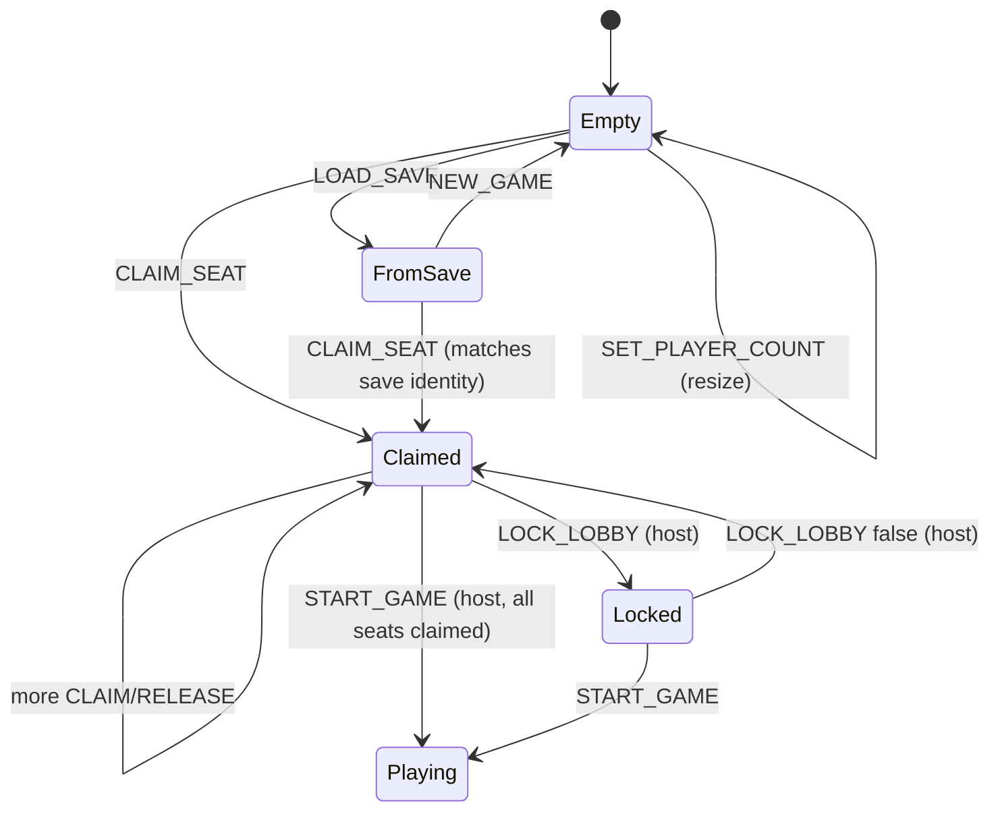
```mermaid
stateDiagram-v2
  [*] --> Empty
  Empty --> Empty: SET_PLAYER_COUNT (resize)
  Empty --> FromSave: LOAD_SAVE
  FromSave --> Empty: NEW_GAME
  Empty --> Claimed: CLAIM_SEAT
  FromSave --> Claimed: CLAIM_SEAT (matches save identity)
  Claimed --> Claimed: more CLAIM/RELEASE
  Claimed --> Locked: LOCK_LOBBY (host)
  Locked --> Claimed: LOCK_LOBBY false (host)
  Claimed --> Playing: START_GAME (host, all seats claimed)
  Locked --> Playing: START_GAME
```

Every function returns either `{ ok: true, lobby }` or
`{ ok: false, reason }`. The host wraps these:

```
result = lobbyFn(...)
if (!result.ok) errorTo(clientId, result.reason)
else { this.lobby = result.lobby; broadcastLobby() }
```

Why pure? Easier to test (`tests/host/lobby.test.ts` runs without a
server), easier to reason about (no shared mutable state), and the
mutations stay reviewable in one short file. The validation that
matters — duplicate names, locked colours, save-pinned identities,
host-only operations — all lives here.

### 4.4 `saves.ts` — fs I/O, with safety

Three responsibilities:

1. **Read / write** save files via `parseSaveFile` / `serializeSave`
   from `src/network/saveFile.ts`.
2. **List** saves with parsed metadata (`SaveSummary` — name,
   playerCount, seed, intentCount, mtime, bytes). Skips unparseable
   files silently so one corrupt save doesn't blank the list.
3. **Resolve user-supplied filenames safely.** `resolveSavePath`
   rejects path traversal (`..`), absolute paths, slashes, and
   anything not ending in `.json`, then double-checks the resolved
   absolute path stays inside `DEFAULT_SAVES_DIR`. This is the only
   place the host accepts user-controlled filename input, so the
   guard matters.

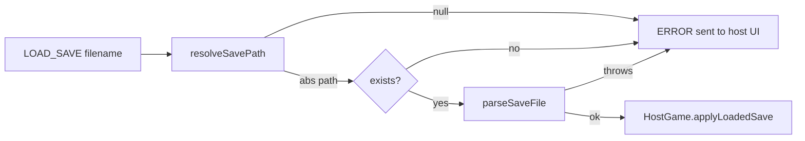
```mermaid
flowchart LR
  IN["LOAD_SAVE filename"] --> R[resolveSavePath]
  R -->|null| ERR[ERROR sent to host UI]
  R -->|abs path| EXISTS{exists?}
  EXISTS -- no --> ERR
  EXISTS -- yes --> PARSE[parseSaveFile]
  PARSE -->|ok| HG[HostGame.applyLoadedSave]
  PARSE -->|throws| ERR
```

---

## 5. The browser-side transport

### 5.1 `WebSocketClient.ts` — pure transport

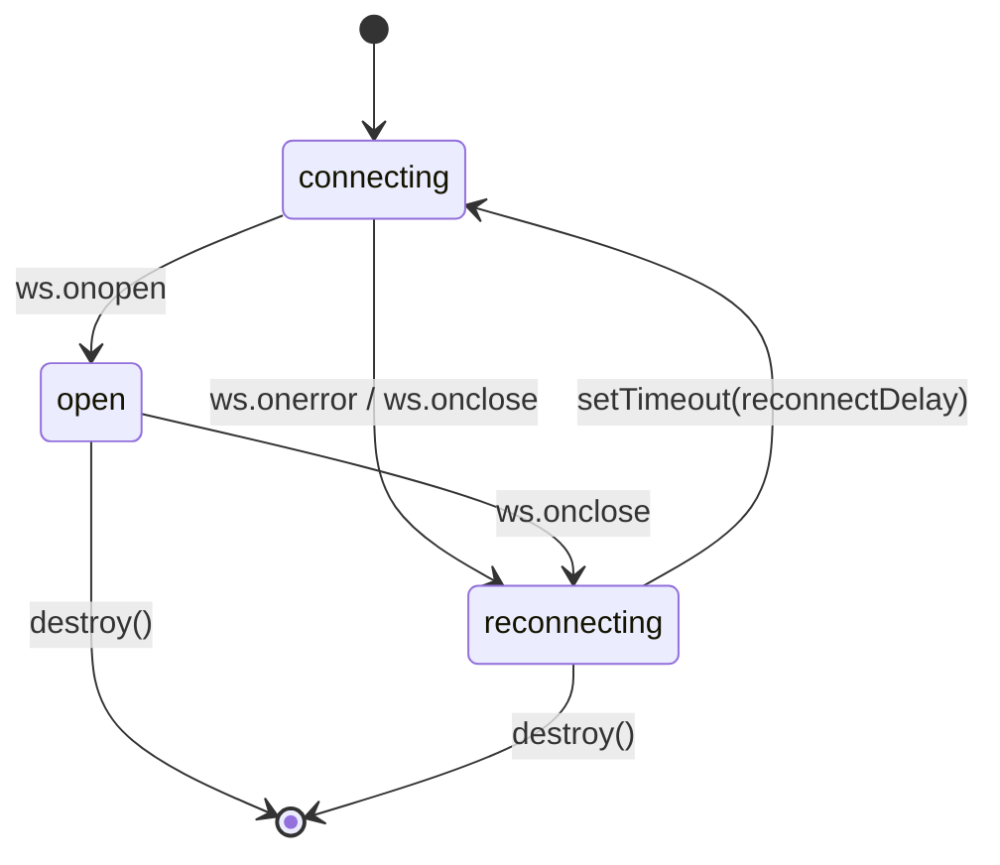
```mermaid
stateDiagram-v2
  [*] --> connecting
  connecting --> open: ws.onopen
  connecting --> reconnecting: ws.onerror / ws.onclose
  open --> reconnecting: ws.onclose
  reconnecting --> connecting: setTimeout(reconnectDelay)
  open --> [*]: destroy()
  reconnecting --> [*]: destroy()
```

Behaviour:

- **Single durable socket.** The application holds one
  `WebSocketClient` for its whole life.
- **Exponential backoff reconnect.** `reconnectDelay` doubles on each
  failure from 500 ms up to a 10 s cap; resets on `onopen`. Network
  blips are invisible to the application.
- **Outbox buffers while disconnected.** `sendIntent` etc. push into
  `outbox` if `readyState !== OPEN`; flushed on the next `onopen`.
- **Decode-then-dispatch.** `parseServerMessage` narrows the payload
  to a typed `ServerMessage`; the switch fans out to typed callbacks
  (`onWelcome`, `onState`, `onSnapshot`, …). Garbage gets `onError`.

This file knows **nothing about game state**. It's a typed message
pump. That separation is what lets `useNetworkClient` evolve (mirror
engine → no mirror engine, with-cause → without-cause) without
rewriting the transport.

### 5.2 `ClientEngine.ts` — engine-shaped facade over a `PlayerView`

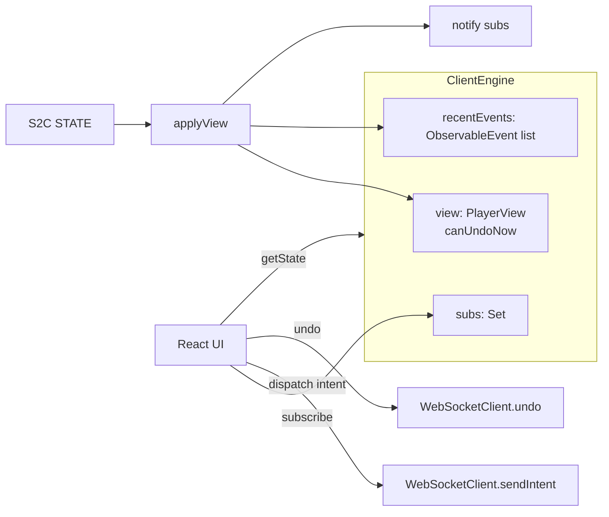
```mermaid
flowchart LR
  subgraph CE["ClientEngine"]
    VIEW["view: PlayerView<br/>canUndoNow"]
    REC["recentEvents: ObservableEvent list"]
    SUBS["subs: Set"]
  end
  STATE["S2C STATE"] --> APPLY[applyView]
  APPLY --> VIEW
  APPLY --> REC
  APPLY --> NOTIFY[notify subs]
  UI[React UI] -- getState --> CE
  UI -- subscribe --> SUBS
  UI -- dispatch intent --> WS["WebSocketClient.sendIntent"]
  UI -- undo --> WSU["WebSocketClient.undo"]
```

**Why this shim exists.** Before the privacy refactor, every browser
ran a *mirror* `Engine` keyed on `(seed, intentLog)` — clients applied
intents locally and the host's job was just to broadcast the log. That
model leaked everything: the seed determined the deck order, the
intent log replayed every secret fact. We removed the mirror.

But the UI was already written against the `Engine` surface
(`getState`, `dispatch`, `undo`, `subscribe`, `getInitialConfig`,
`getInitialBundle`, `getIntentLog`, `canUndo`). Rather than rewrite
every panel, we built `ClientEngine` to mimic the surface:

| `Engine` method | `ClientEngine` behaviour |
|---|---|
| `getState()` | Returns the held `PlayerView` cast as `GameState`. |
| `dispatch(intent)` | Forwards to `ws.sendIntent`; returns `{ ok: true }` synchronously. The UI sees the result when STATE arrives. |
| `undo()` | Forwards to `ws.undo` if `canUndoNow`. |
| `canUndo()` | Reads the host-supplied flag. |
| `subscribe(cb)` | Standard observer; `applyView` calls every cb. |
| `getInitialConfig()` | Synthetic `{ seed: 0, playerCount }` — the real seed never leaves the host. |
| `getIntentLog()` | Returns `[]`. |
| `getRecentEvents()` *(new)* | Returns the locally-derived event log. |

The cast `as unknown as GameState` is deliberate: the two shapes
overlap on every public field. The only divergent slots (drawDeck,
removedCards, others' hands) carry HIDDEN-card placeholders so
`.length` is honest and `card.kind` switches just learn one new arm.

### 5.3 `eventLog.ts` — derived public history

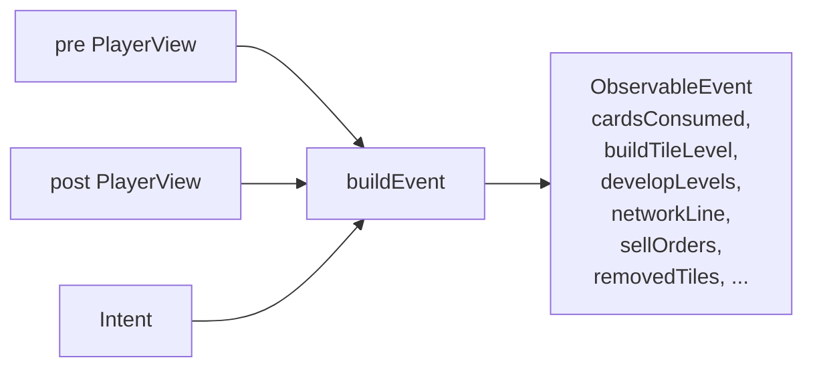
```mermaid
flowchart LR
  PRE["pre PlayerView"] --> BE[buildEvent]
  POST["post PlayerView"] --> BE
  INT["Intent"] --> BE
  BE --> EV["ObservableEvent<br/>cardsConsumed,<br/>buildTileLevel,<br/>developLevels,<br/>networkLine,<br/>sellOrders,<br/>removedTiles, ..."]
```

Every client receives the same STATE stream's *causes* and the same
view diffs (because public surfaces are the same for every viewer).
Each client therefore derives the *same* `ObservableEvent[]` log
locally — no extra wire traffic, provable consistency.

`buildEvent` reads only public surfaces:

- `cardsConsumed` ← diff of the actor's `discardPile` (public).
- `buildTileLevel` ← the new entry in `builtTiles`.
- `networkLine` ← `lines[intent.lineIndex].endpoints`.
- `developLevels` ← pre-view's mat-stack catalogue indices.
- Sell orders / removed tiles ← `builtTiles.find(id)`.

Wild-card plays are an edge case: a wild card returns to the wild
reserve, not the discard pile, so `cardsConsumed` is empty for that
intent. The headline still reads correctly; surfacing the wild via a
`wildReserve` diff is a future enhancement.

### 5.4 `useNetworkClient.ts` (the React hook that ties it together)

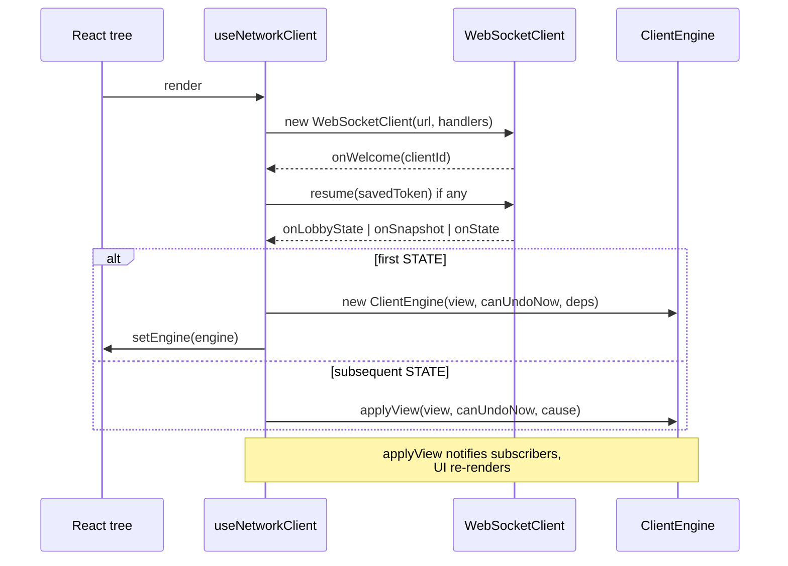
```mermaid
sequenceDiagram
  participant UI as React tree
  participant H as useNetworkClient
  participant WS as WebSocketClient
  participant CE as ClientEngine
  UI->>H: render
  H->>WS: new WebSocketClient(url, handlers)
  WS-->>H: onWelcome(clientId)
  H->>WS: resume(savedToken) if any
  WS-->>H: onLobbyState | onSnapshot | onState
  alt first STATE
    H->>CE: new ClientEngine(view, canUndoNow, deps)
    H->>UI: setEngine(engine)
  else subsequent STATE
    H->>CE: applyView(view, canUndoNow, cause)
  end
  Note over H,CE: applyView notifies subscribers,<br/>UI re-renders
```

The hook also persists the seat token to `localStorage` (per host URL)
so a page refresh / device migration resumes seamlessly.

---

## 6. The privacy boundary

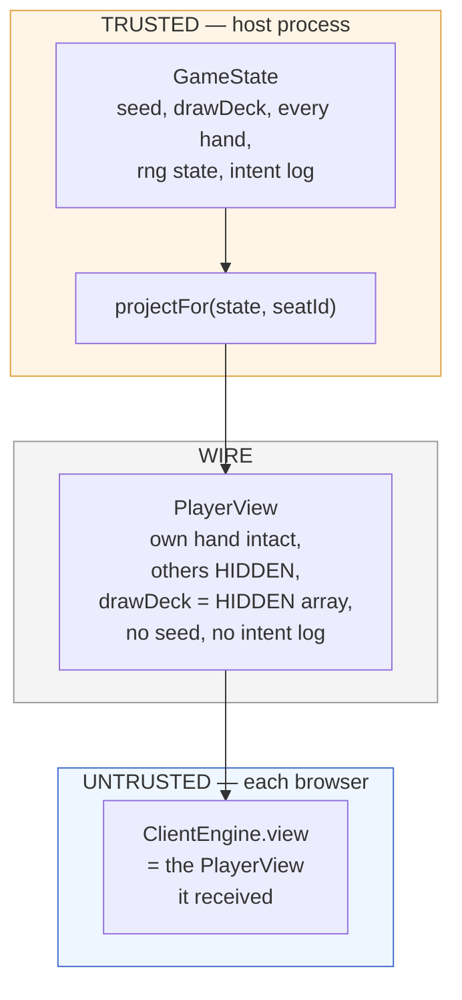
```mermaid
flowchart TB
  subgraph trusted["TRUSTED — host process"]
    GS["GameState<br/>seed, drawDeck, every hand,<br/>rng state, intent log"]
    PROJ["projectFor(state, seatId)"]
    GS --> PROJ
  end
  subgraph wire["WIRE"]
    PV["PlayerView<br/>own hand intact,<br/>others HIDDEN,<br/>drawDeck = HIDDEN array,<br/>no seed, no intent log"]
  end
  subgraph untrusted["UNTRUSTED — each browser"]
    CE2["ClientEngine.view<br/>= the PlayerView<br/>it received"]
  end
  PROJ --> PV
  PV --> CE2
  style trusted fill:#fff5e6,stroke:#e0a040
  style untrusted fill:#eef6ff,stroke:#406bcc
  style wire fill:#f4f4f4,stroke:#999
```

The redaction happens **once** — inside `projectFor`, called from
`HostGame.envelopeFor` — and `PlayerView` is the only shape that
crosses the wire. There is no code path where a `GameState` object
reaches the wire, because the wire is typed as `PlayerView` and TS
won't let one substitute. That makes the boundary auditable: grep for
`projectFor` to find every place secrets get filtered.

The seed and intent log are deliberately *absent* from `PlayerView`,
not merely zeroed out. A client can't accidentally read them because
they never arrive.

---

## 7. End-to-end message flows

### 7.1 Joining the lobby

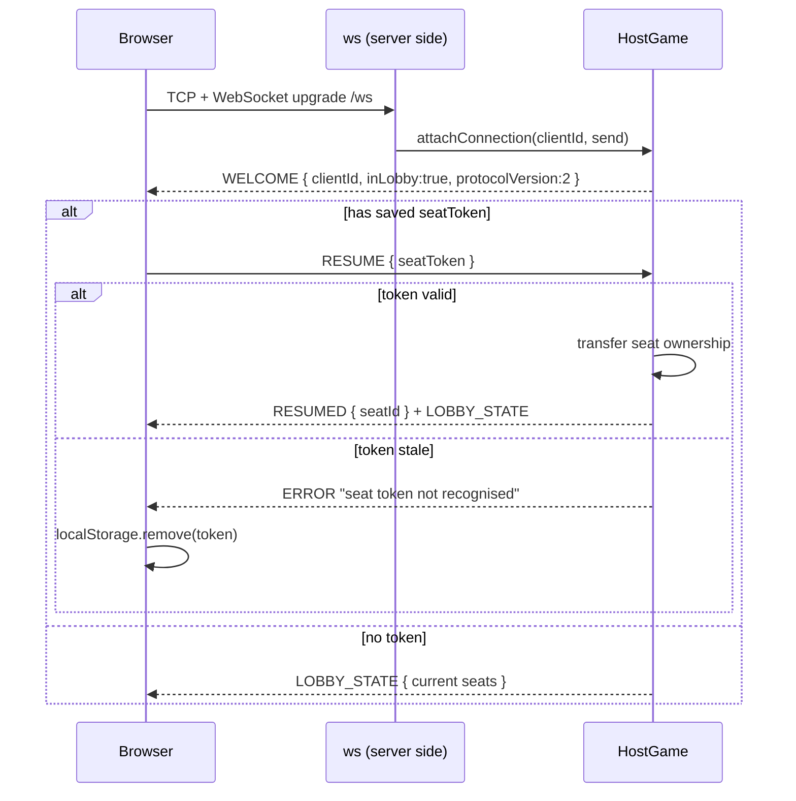
```mermaid
sequenceDiagram
  participant Bro as Browser
  participant WS as ws (server side)
  participant HG as HostGame
  Bro->>WS: TCP + WebSocket upgrade /ws
  WS->>HG: attachConnection(clientId, send)
  HG-->>Bro: WELCOME { clientId, inLobby:true, protocolVersion:2 }
  alt has saved seatToken
    Bro->>HG: RESUME { seatToken }
    alt token valid
      HG->>HG: transfer seat ownership
      HG-->>Bro: RESUMED { seatId } + LOBBY_STATE
    else token stale
      HG-->>Bro: ERROR "seat token not recognised"
      Bro->>Bro: localStorage.remove(token)
    end
  else no token
    HG-->>Bro: LOBBY_STATE { current seats }
  end
```

### 7.2 Claim a seat

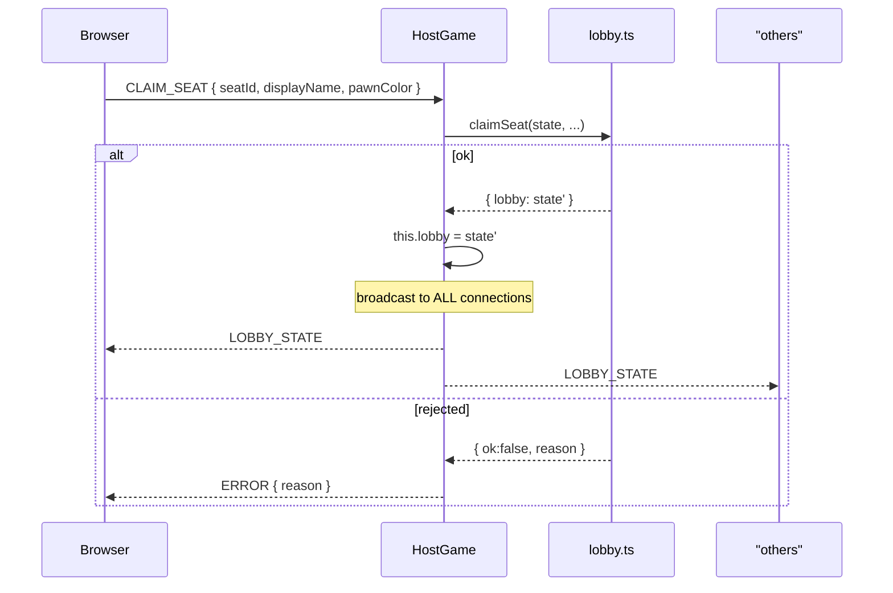
```mermaid
sequenceDiagram
  participant Bro as Browser
  participant HG as HostGame
  participant LB as lobby.ts
  Bro->>HG: CLAIM_SEAT { seatId, displayName, pawnColor }
  HG->>LB: claimSeat(state, ...)
  alt ok
    LB-->>HG: { lobby: state' }
    HG->>HG: this.lobby = state'
    Note over HG: broadcast to ALL connections
    HG-->>Bro: LOBBY_STATE
    HG-->>"others": LOBBY_STATE
  else rejected
    LB-->>HG: { ok:false, reason }
    HG-->>Bro: ERROR { reason }
  end
```

### 7.3 Start game

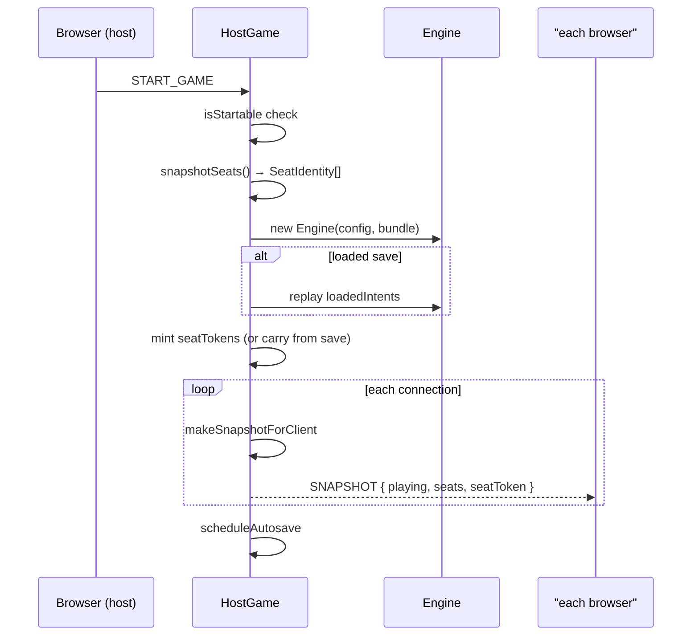
```mermaid
sequenceDiagram
  participant Host as Browser (host)
  participant HG as HostGame
  participant Eng as Engine
  Host->>HG: START_GAME
  HG->>HG: isStartable check
  HG->>HG: snapshotSeats() → SeatIdentity[]
  HG->>Eng: new Engine(config, bundle)
  alt loaded save
    HG->>Eng: replay loadedIntents
  end
  HG->>HG: mint seatTokens (or carry from save)
  loop each connection
    HG->>HG: makeSnapshotForClient
    HG-->>"each browser": SNAPSHOT { playing, seats, seatToken }
  end
  HG->>HG: scheduleAutosave
```

### 7.4 Dispatch an intent (already shown in §4.2.1)

### 7.5 Undo

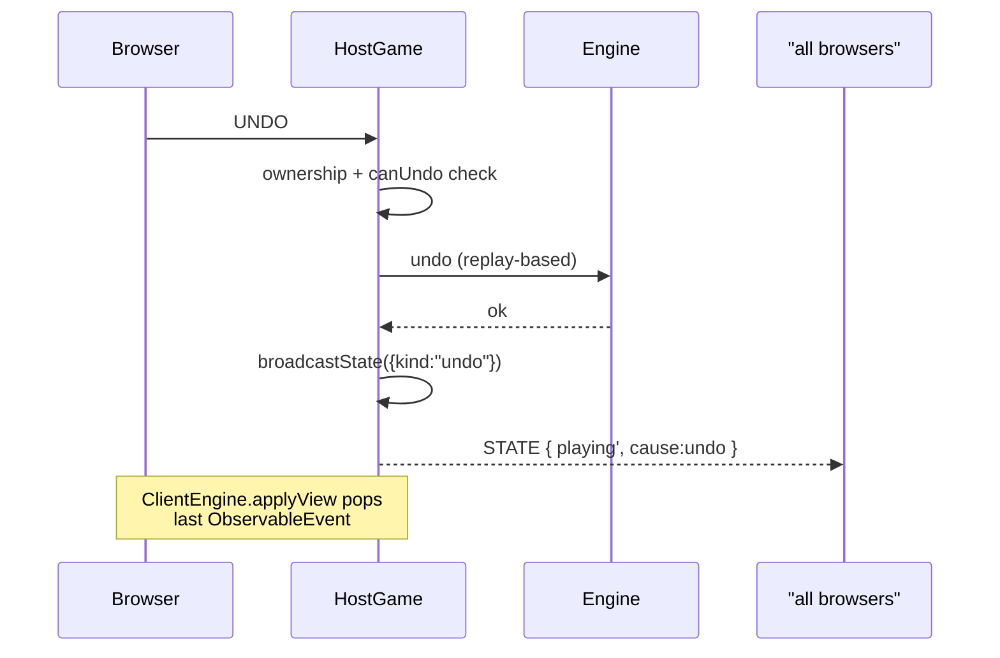
```mermaid
sequenceDiagram
  participant Bro as Browser
  participant HG as HostGame
  participant Eng as Engine
  Bro->>HG: UNDO
  HG->>HG: ownership + canUndo check
  HG->>Eng: undo (replay-based)
  Eng-->>HG: ok
  HG->>HG: broadcastState({kind:"undo"})
  HG-->>"all browsers": STATE { playing', cause:undo }
  Note over Bro,HG: ClientEngine.applyView pops<br/>last ObservableEvent
```

### 7.6 Reconnect from a different device

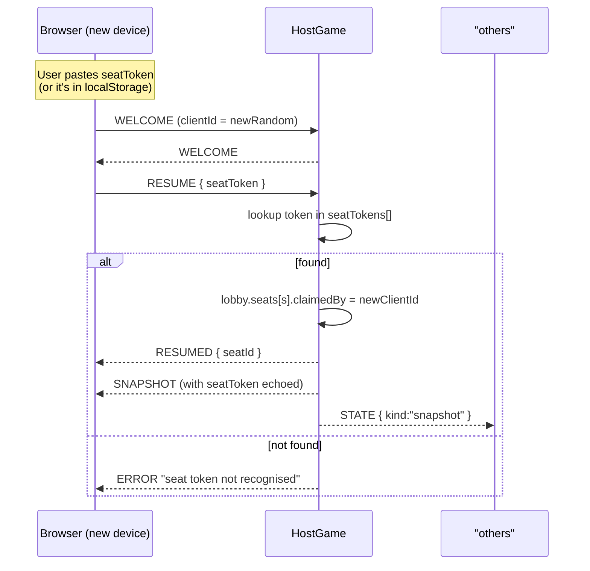
```mermaid
sequenceDiagram
  participant New as Browser (new device)
  participant HG as HostGame
  Note over New: User pastes seatToken<br/>(or it's in localStorage)
  New->>HG: WELCOME (clientId = newRandom)
  HG-->>New: WELCOME
  New->>HG: RESUME { seatToken }
  HG->>HG: lookup token in seatTokens[]
  alt found
    HG->>HG: lobby.seats[s].claimedBy = newClientId
    HG-->>New: RESUMED { seatId }
    HG-->>New: SNAPSHOT (with seatToken echoed)
    HG-->>"others": STATE { kind:"snapshot" }
  else not found
    HG-->>New: ERROR "seat token not recognised"
  end
```

The old device, if still connected, continues to receive STATEs but
its seat is now held by the new device — any intent it sends will be
rejected by the seat-ownership check. This is intentional: the bearer
capability is the seatToken, and possession transfers it.

---

## 8. What's missing (production hardening)

The current design is solid for trusted-friend hosting on a private
network. Public deployment would want:

- **TLS** — `wss://` with a real certificate. Today the protocol runs
  in cleartext.
- **Authentication beyond seat tokens** — bind seats to user accounts
  so a stolen token can be revoked centrally; today the token *is*
  the credential.
- **Schema-validated parsing** — `parseClientMessage` checks the
  `type` field but not field types within. A malformed `INTENT` could
  reach the engine and throw inside `reduce`. zod or @sinclair/typebox
  would close this.
- **Rate limiting** — per-connection caps on intents/sec to blunt
  pathological clients.
- **Audit log** — append-only record of who did what when, separate
  from the autosave, for moderation.
- **Protocol-version negotiation** — `WELCOME` carries the version
  but the host doesn't yet *enforce* a match; an old client connecting
  to a new host would silently misinterpret messages.

None of these change the privacy model — they're orthogonal hardening.

---

## 9. Why the layering pays off

The split into `host/` (Node) and `src/network/` (browser-shared) plus
the explicit `protocol.ts` boundary buys several things:

1. **The engine doesn't know about networking.** `src/engine/` has no
   import from `src/network/` or `host/`. It's a pure library both
   sides wrap. Adding multiplayer didn't touch the rules.
2. **Privacy is enforced at one auditable point.** `projectFor` is the
   single place where "public state" becomes "this seat's view". You
   can read that one function and trust the rest.
3. **The browser is dumb.** `ClientEngine` doesn't apply intents — it
   just renders what the host hands it. There's no "client-side
   reducer disagrees with host" failure mode because there's no
   client-side reducer.
4. **The transport is replaceable.** `WebSocketClient` is one file
   implementing a typed message pump. Swapping to WebRTC or
   long-polling is a rewrite of one file, not the whole layer.
5. **The lobby is testable in isolation.** `lobby.ts` is pure;
   `tests/host/lobby.test.ts` runs without a server, network, or
   engine.

The cost is a little ceremony — separate files, an explicit message
type for everything, a typed projection. The payoff is that "is this
secret leaking?" is answerable by reading one function, and "can I
add a verb?" is answerable by reading the protocol union.
